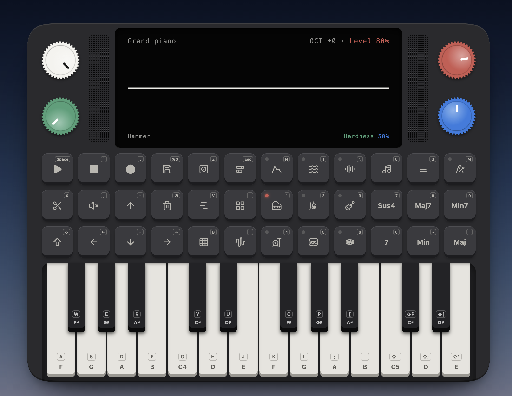

> source available. all rights reserved.  
> AI was used and paid for.  
> no copyright infringement intended.

# Studio

Studio is a browser-based instrument. The home page hosts **The Device**: a digital version of a physical desktop synthesizer.

## Docs

These docs, and this README, are also served in the app at `/docs` (`app/routes/docs.tsx`). The route reads every markdown file under `docs/` at build time and lists it in its sidebar, so a new doc only needs a new file.

### Project

What Studio is and how it works.

#### [The Device](docs/project/the-device.md)

The home page's synthesizer, from the outside in. A file-by-file map covers the case and its parts, the screen and piano roll, transport, tracks and the album, chord progressions, drum beats and export. Then come the design rules: fixed native size, two spacing tokens, theme colours that cross-fade, and hotkeys that never overlap. Last is the architecture: a stack of providers holds the live state, and every view is a mode that rebinds the same fixed hardware.

#### [Synth engine](docs/project/synth-engine.md)

The physical-modeling engine the Device plays through: every voice is an exciter driving a resonator, rendered sample-accurately in one `AudioWorkletProcessor`. A table covers each instrument family (strings, bowed, blown, free reeds, tuned percussion, drums and a plain oscillator) and its model. The rest is the practical side: the mix chain around the voices, the source layout, the `physicalSynth` API, how tuning and loudness are calibrated, and how to audition instruments, add a patch or add a Device preset.

#### [How the synth works](docs/project/synth-model.md)

A longer walkthrough of the engine, with diagrams, for anyone changing the DSP. It follows a note from the worklet and render loop through the signal flow and voice lifecycle. Then it goes through each instrument model in depth, along with bodies, the FDN reverb, the parameter system, the path from key press to sound, calibration and a file map.

#### [Chord progressions](docs/project/chord-progressions.md)

The source material behind the Device's chord progressions (Shift + Piano roll), compiled from all 51 videos of David Bennett's chord progressions playlist. Each entry gives the progression in Roman numerals, songs that use it and a short note on why it works, credited to him throughout.

### Development

Working on Studio: setting it up, its stories and the rules agents follow.

#### [Installation](docs/development/installation.md)

Getting Studio running and keeping it healthy. Install with `npm install`, then run the app on port `5173` and Storybook on `6006`. Build either one for production. Run the checks (typecheck, the DSP and engine unit tests, the headless story smoke tests, lint and format), and clean out build artifacts and dependencies when you want a fresh start.

#### [Storybook](docs/development/storybook.md)

How the component stories are organized: `Design System`, `Home`, `Page`, `Docs` and `Lab` titles, colocated with their components, each linked to its page in the app's `/storybook`. It also covers the conventions every story follows: a `Default` story bound to props, `autodocs`, a one-line description, the `withDevice` and `withDocs` decorators, and light and dark coverage through the theme addon.

#### [Agent guidelines](docs/development/agent-guidelines.md)

The rules for AI agents working in this repo. Stories start with a `Default` and add only focused variants. Styling is Tailwind only, with `tv` for variants and types instead of interfaces. Scratch and restating comments are stripped before handing work back, and no interaction tests are written without asking first.

## Credits

The Device's chord progressions are based on the chord progression analyses by **David Bennett** of [David Bennett Music Theory](https://www.youtube.com/channel/UCz2iUx-Imr6HgDC3zAFpjOw), compiled from his [chord progressions playlist](https://www.youtube.com/playlist?list=PLlx2eo2tD6KpfGmE-MXwcIRQh21neAKsK). All credit for the analyses, their names and the song examples goes to him; watch his videos for the full explanations.
